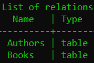
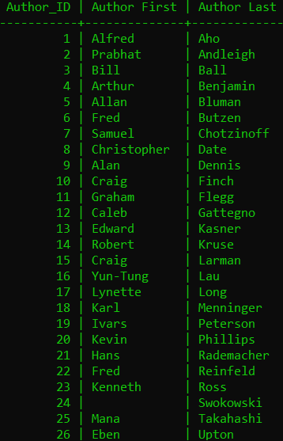

# Books Database  

## Template On How To Connect To An Online Database  

>``psql -h <REMOTE HOST> -p <REMOTE PORT> -U <DB_USER> <DB_NAME>``    

## Maybe Add How I Connect To Jeff's Online Database  

Not Sure If I Should Put The Database Name Online  

## Picture Of The Two Tables I Have  

  

## Picture Of Whats In The Authors Table  

  
