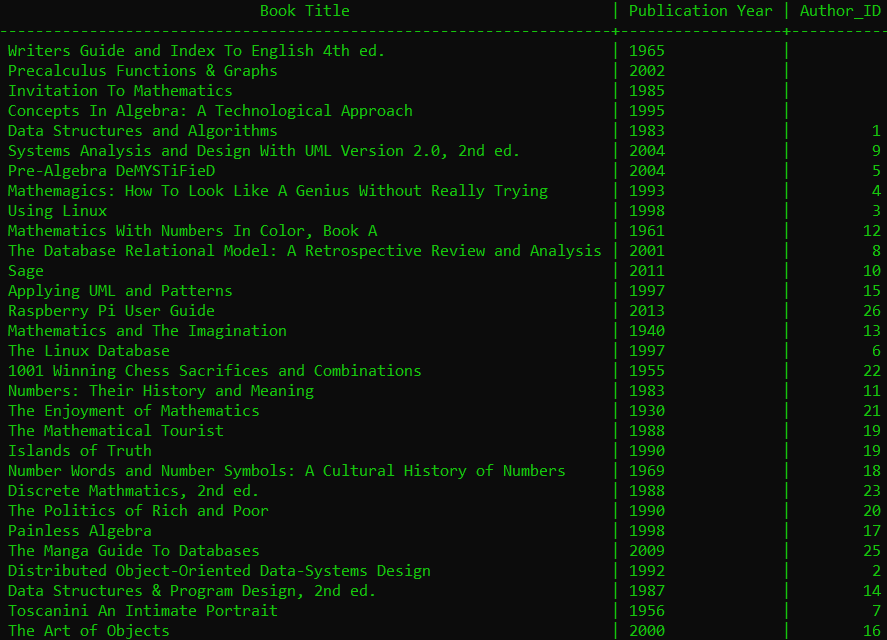
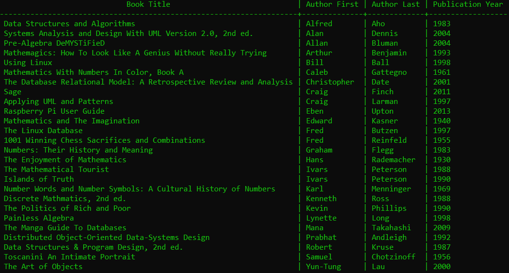

# Books Database  

## Template On How To Connect To An Online Postgresql Database  

>``psql -h <REMOTE HOST> -p <REMOTE PORT> -U <DB_USER> <DB_NAME>``  

## Picture Of The Two Tables I Have  

  

## Picture Of Whats In The Authors Table  

  

## Picture Of Whats In The Books Table  

  

## Joining The Two Tables  

You Don't Need The Double Quotes For Everything But I Did It Just In Case Because I Was Getting An Error

>``SELECT "Books"."Book Title", "Authors"."Author First", "Authors"."Author Last", "Books"."Publication Year" FROM "Authors" JOIN "Books" ON "Authors"."Author_ID" = "Books"."Author_ID";``  

The "Author". and The "Books". Is Used When You Have The Same Named Fields In Both Tables So It Specifies Which Table...  

I Don't Think I Need This But I'm Using It For Demonstration  

## Picture Of What Both Tables Joined Looks Like  

  
