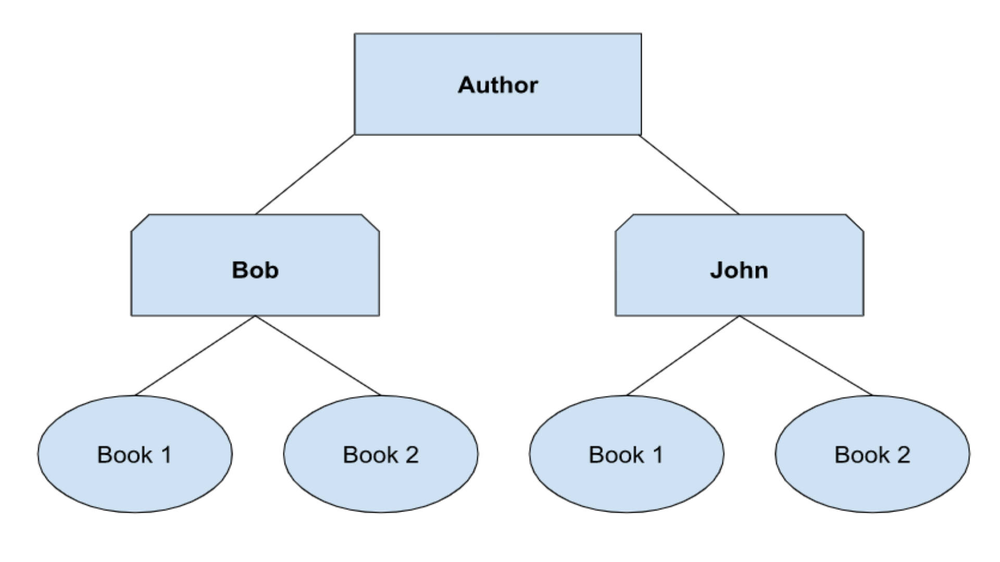

# Other Notes

## What Is SQL | Simple Terms  

***SQL*** Stands For **Structured Query Language**  
It Is A Language That We Will Use To Talk To Our **Database** Which For Us Is Postgresql  

## What Is A Database | Simple Terms

***DataBase*** Is A Structured Set of Data  

## Brief History Of SQL  

***SEQUEL*** Was SQLs **Original Name** and Stood For **Structured English Query Language** Which Was Made In 1974.
 Two People That Worked At IBM Named Donald D. Chamberlin and Raymond F. Boyce Made It Based On SQUARE and Got The Idea From E.F. Codd's 1970 Publication On Relational Databases Called:
>A Relational Model of Data for Large Shared Data Banks.  

There Was A Trademark Issue On The Acronym **SEQUEL** So They Changed It To **Structured Query Languag**e Also Called **SQL**

## Declarative vs Imperative

***Declarative*** Could Be Referred To As What Will Happen

- Don't Know How It Will Happen
- Ex: Make Me A Grilled Cheese With Tomato
- Happens Behind The Scenes
- Powerful In Simplicity and Can Be More Productive
- Functional or Logic Programming  

***Imperative*** Could Be Referred To As How It Will Happen

- Do This - Then That - Then This
- Ex: You Say To Slice The Bread - Add The Cheese - Add The Tomato - Then Grill It
- Know Whats Happening
- More Flexability and Power But Can Get More Complicated
- OOP, Procedural, or Structured Programming

**SQL** Is Declarative  
**Java** Is Imperative  
**Python** Can Be Both Declarative and Imperative  

## Database Model  

A Way To Organize and Store Your Data **But** Does So Much More  

***Database Model Examples***  

- Hierarchical
- Networking
- Entity-Relationship
- ***Relational***
- object Oriented
- Flat
- Semi-Structured
- **Many More**

**Hierarchical Model** Stores Data In A Tree Like Structure  
Concept of Parent Child  
A Child Can Only Have **One** Parent But The Parent Can Have **Multiple** Children  
One To Many Realtionships

**Networking Model** Expanded On The **Hierarchical Model** Allowing **Many To Many Relationships**  
Child Can Have **Multiple** Parents  
  
***Relational*** One of The Most Popular and Widely Used Models Out There
